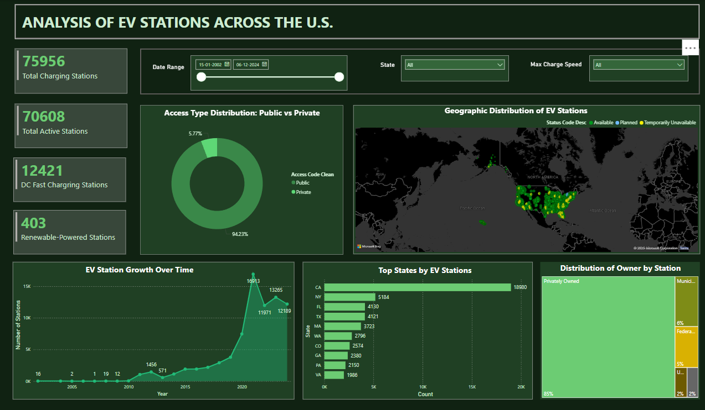

# EV Charging Station Analysis ⚡🚗  

## 📌 Business Problem  
This project analyzes **EV charging station data** to identify trends, gaps, and opportunities for **sustainable growth**. Key objectives include:  

- 🔍 **Targeting underserved regions** for EV station expansion.  
- 🌱 **Promoting eco-friendly energy solutions** in the charging network.  
- ⚡ **Assessing the availability of fast charging stations** to meet demand.  
- 🏢 **Understanding ownership distribution** in the EV infrastructure sector.  

## 📊 Dataset Used  
- **Source**: [U.S. Department of Energy – Alternative Fuels Data Center](https://afdc.energy.gov)  
- **Total Records**: 78,837  
- **Key Data Processing Steps**:  
  - Data **collection and cleaning**  
  - **Exploratory Data Analysis (EDA)** and **feature engineering**  
  - **Dashboard design** and visualization  
  - **Advanced analytics & forecasting**  

## 🔍 Exploratory Data Analysis (EDA)  
Key **data validation and preprocessing** steps:  
- ✅ **Null Value Check** for missing data.  
- ✅ **Data Distribution Analysis** to understand variable distributions.  
- ✅ **Duplicate Check** to ensure data integrity.  

[Google Colab Notebook](https://colab.research.google.com/drive/1sChZ5tM8U8pLikmMfLWPOQvwOIuN1v16?usp=sharing)

## 📈 Analysis Performed  
- 📅 **Trend Analysis Over Time**: EV station growth since 2010.  
- 🔐 **Access Type Distribution**: Public vs. private charging station availability.  
- 📍 **Top States by EV Station Utilization**: Identifying high-demand areas.  
- ⚡ **Availability of Fast Chargers**: Percentage of stations offering **DC Fast Charging**.  
- 🏢 **Classification of Key Stakeholders**: Ownership analysis.  
- 🤖 **ML Forecasting for Future Expansion**: Predicting future station growth.  

## 📊 Charts & Metrics Used  
- 📈 **Area Chart**: Growth trends over time.  
- 📊 **Bar Chart**: EV station count by category.  
- 🍩 **Donut Chart & Tree Map**: Ownership distribution.  
- 🗺 **Geospatial Map**: Charging station locations.  
- 🤖 **ML Prediction (MAQ Chart)**: Forecasting future station expansions.  

### 📊 **Dashboard Link**  
[Power BI Report](https://app.powerbi.com/groups/me/reports/2df8ca23-ccda-44ce-bf88-e7c20369b9b2/56dcbb3684d7de188dac?experience=power-bi)  


## 🔍 Advanced Features  
- 📊 **DAX Metrics** for real-time insights.  
- ❓ **Q&A Feature**: AI-powered data exploration.  
- 🔍 **Key Influencers & Decomposition Tree**: Understanding data drivers.  

## 📌 Conclusion  
- 🌎 **California leads** in EV charging stations, highlighting strong infrastructure support.  
- 🏪 **95% of stations are publicly accessible**, ensuring easy availability.  
- 📈 **Steady EV station growth** since 2010, with a major surge after 2019.  
- 🏢 **Over 85% are privately owned**, emphasizing corporate involvement.  
- ⚡ **Only 18% offer DC Fast Charging**, with **<1% using renewable energy**, revealing key areas for sustainability improvements.  

## 🚀 Future Scope  
- 📡 **Integration with real-time data** for monitoring utilization and downtime.  
- 🗺 **Geo-spatial analysis & clustering** to recommend **optimal new station locations**.  
- ⭐ **User reviews & sentiment analysis** to enhance service quality.  

---

### ⚡ **How to Use This Repository**  
1. **Clone the repo**:  
   ```sh
   git clone https://github.com/your-username/EV-Charging-Analysis.git
